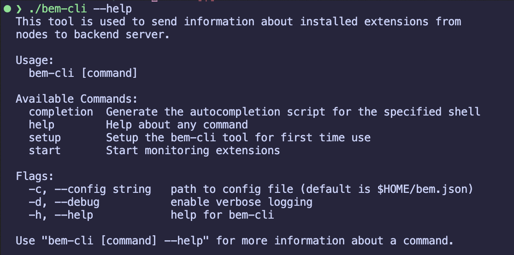
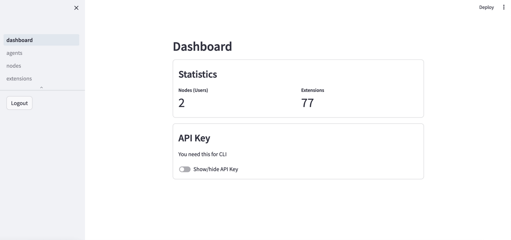
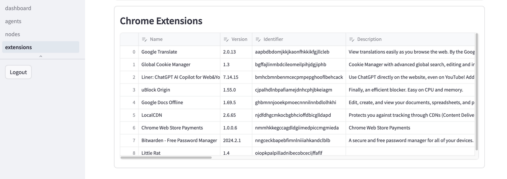
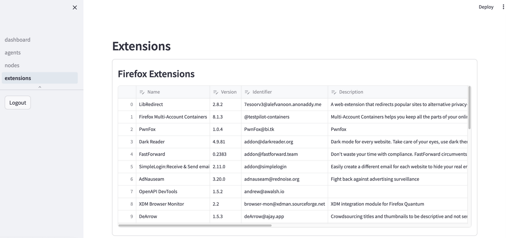
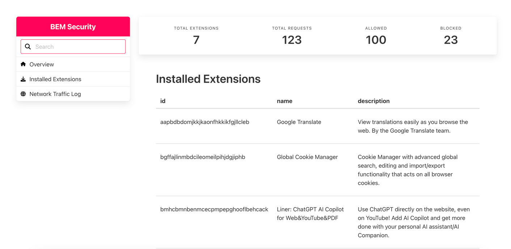

# Browser-ext-mon
Browser extension monitoring, management and security analysis

## Summary
This is a monorepo for our final year project. The aim of this project is to create a CLI tool, a frontend dashboard, and an extension to enable users to see what extensions they have in their browsers, understand the risks these extensions carry, and take action against the risky ones, all from a single place. This idea is very useful in organizations.

As this project uses [osquery](https://osquery.io/) to monitor installed extensions in browsers, it can be extended to also monitor extensions installed in code editors and IDEs supported by osquery. Check the available tables at https://osquery.io/schema/5.12.1/.

## Architecture and setting up
```
.
|- backend
  |- osquery-be  <- backend for osquery, and our extension; language: Python/FastAPI
  |- pb  <- backend service based on Pocketbase; language: Go/Pocketbase
|- cli  <- codebase for the CLI tool; language: Go
|- docs
  |- diagrams  <- primarily D2 diagrams; language: D2
  |- ...  <- other docs components, including presentation
|- extension <- our extension, uses MV3; language: TypeScript/Vue/Plasmo
|- frontend
  |- app  <- initially planned Nuxt frontend app; not in use now; language: Vue/Nuxt
  |- streamlit-app  <- current frontend app using Streamlit; language: Python/Streamlit
    |- dragonfly <- to cache user auth token, which needed to be introduced due to a limitation in streamlit
```

Check the [wiki](https://github.com/jarp0l/browser-ext-mon/wiki) for more information.


> :warning: **Warning:** The project is just a PoC, unstable and untested for use in production, and may not follow best practices in all cases, security or otherwise. However, improvements are possible. Use at your own risk!

---

## Abstract from our report
Web browser extensions allow for the customization of web browser functionality by utilizing the APIs provided by browser vendors. However, malicious extensions can exploit the level of access granted by these APIs to obtain sensitive user information without their knowledge, thus presenting a significant threat to personal and organizational confidentiality within an organizational setting. In order to mitigate such risks, this project proposes a solution that seeks to bolster both personal and organizational security through the implementation of an integrated system for monitoring and managing extensions, as well as leveraging AI to evaluate the potential risks associated with these extensions. This solution involves the creation of an interconnected system, comprising a Command Line Interface (CLI) tool, a browser extension, a frontend interface, and multiple API servers in the backend. Such a system can be beneficially utilized by individuals, and by IT and security teams in organizations. The AI based security analysis follows both dynamic and static approaches.The static approach consists of classifying malicious/vulnerable and benign extensions with the use of CNN to detect patterns in the scripts, which ultimately predicts XSS attacks vulnerability of extensions with an accuracy of 97%. The dynamic approach encompasses analysing the URLs generated during the operation of the extensions using XGBoost, RFC and LightGBM Classifier with RFC providing better accuracy of 96.6%. The analysis broadened further without the limitation of AI and incorporated factors such as: manifest analysis, risky functions analysis, CSP analysis and vulnerable library analysis to determine the security of an extension.

Keywords: *web browser extensions, security, monitoring, artificial intelligence*


## Objectives
1. Develop CLI Tool and Browser Extension:
  - To create a CLI tool for monitoring browsers installed, browser extensions in each browser and managing the extensions remotely.
  - To develop a browser extension for monitoring network traffic of other extensions and, optionally, blocking malicious network requests.

2. Web Dashboard for Data Visualization:
  - To create a user-friendly web dashboard for easy access to relevant data and insightful statistics about extensions.
  - To enhance understanding of potential risks through visualizations.

3. Implement AI-driven and Conventional Security Analysis:
  - To utilize Convolutional Neural Network (CNN) to proactively detect compromised browser extensions through which various attacks can be carried out.
  - To use Machine Learning (ML) to detect phishing, defacement attacks, drive by download attack which installs malware conducted by browser extensions through URL.
  - To detect potentially vulnerable/malicious extensions through ruled-based scoring metrics.


## Screenshots

> :warning: **Warning:** Not all the screenshots show the latest versions/changes.


CLI Tool:




Dashboard:







The extension:



---

## Contributors
- Lincoln [@lincoln5702](https://github.com/lincoln5702)
- Prajwol [@jarp0l](https://github.com/jar0l)
- Prakriti [@Prakriti03](https://github.com/Prakriti03)

## License
This project is licensed under GNU AGPL v3.0. See the [LICENSE](./LICENSE) file for more details. Contributions and works by other authors have been duly credited where applicable, and their original licenses have been referenced.
